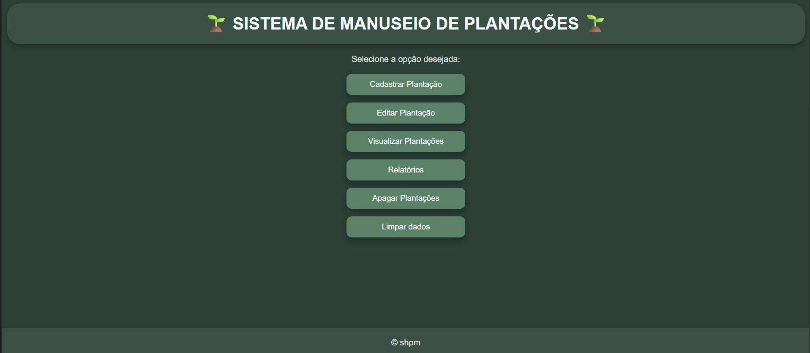

# 🌱 Mini Sistema de Manuseio de Plantações (Web)


Mini sistema web para cadastro, edição e visualização de plantações, desenvolvido com HTML, CSS e JavaScript puro (sem frameworks ou backend). Os dados são armazenados localmente no navegador via localStorage.

Este é o par web do [Mini Sistema de Manuseio de Plantações (CLI)](https://github.com/saulohpm/mini-sistema-plantacoes-python), o mesmo domínio de negócio reimplementado como aplicação web, praticando manipulação de DOM e formulários multi-página sobre um problema já modelado na versão de terminal.



## 🎯 Objetivo do Projeto

Praticar, especificamente:

- Manipulação de DOM e formulários em múltiplas páginas HTML
- Sincronização de estado entre páginas via localStorage
- Geração de relatórios a partir de dados armazenados localmente
- Estruturação de um pequeno sistema web sem frameworks, do zero

---

## ✨ Funcionalidades

- Cadastro de plantações
- Visualização das plantações cadastradas
- Edição de dados de uma plantação
- Geração de relatórios
- Remoção de plantações individuais
- Limpeza completa dos dados armazenados
- Persistência local com `localStorage`

---

## 🛠️ Tecnologias

- HTML5
- CSS3
- JavaScript (Vanilla)
- `localStorage`

---

## 📂 Estrutura do Projeto
```bash
mini-sistema-plantacoes-web/
├── index.html
├── README.md
│
├── pages/
│ ├── cadastrar.html
│ ├── editar.html
│ ├── visualizar.html
│ ├── relatorios.html
│ └── apagar.html
│
├── js/
│ ├── main.js
│ └── utils.js
│
├── css/
│ └── style.css
│
└── assets/
└── favicon.png
```
---

## ▶️ Execução

**Opção 1 — Demonstração online:**  
https://saulohpm.github.io/mini-sistema-plantacoes-web/index.html

**Opção 2 — Localmente:**

```bash
git clone https://github.com/saulohpm/mini-sistema-plantacoes-web.git
cd mini-sistema-plantacoes-web
```

Abra o arquivo `index.html` em qualquer navegador moderno. O sistema funciona localmente e não requer servidor.

---

## 📝 Observações

- Os dados ficam salvos apenas no navegador do usuário
- A limpeza do cache do navegador remove todos os dados
- O projeto não utiliza backend nem banco de dados externo
- A arquitetura JavaScript é procedural
- Projeto desenvolvido para fins de estudo